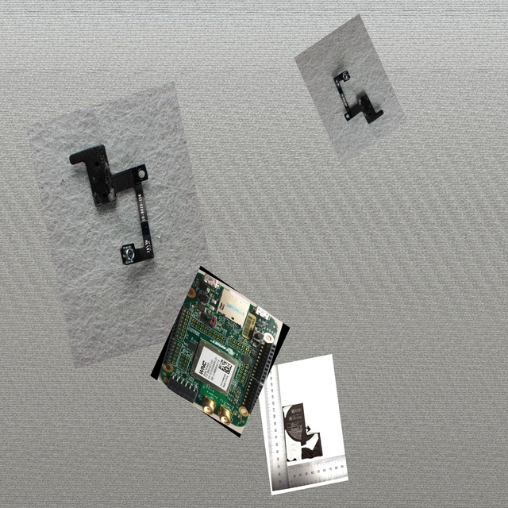
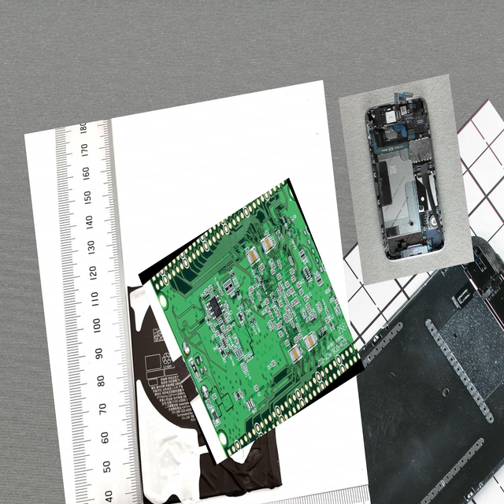
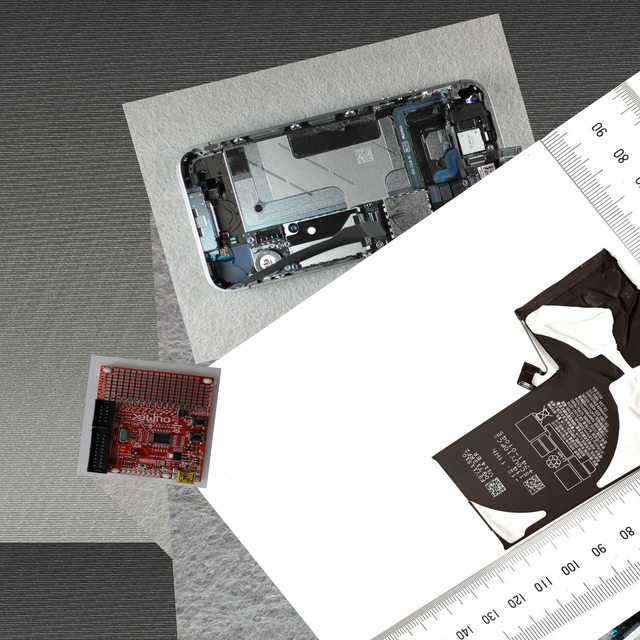

# PCB Detection with YOLO11 and Hailo-10H


[](https://www.gnu.org/licenses/gpl-3.0)

This repository provides a comprehensive guide and tools for building a Printed Circuit Board (PCB) detection model
using YOLO11 with Oriented Bounding Boxes (OBB). The model is optimized for deployment on the Hailo-10H AI accelerator.

> **Note:** This project is inspired by the [SanderGi PCB-Detection](https://github.com/SanderGi/PCB-Detection.git)
> repository.

## Technologies

### Software

* **[YOLO11](https://docs.ultralytics.com/models/yolo11/):** Specifically utilizing Oriented Bounding Boxes (OBB) for
  precise PCB orientation detection.
* **[Python 3.12](https://www.python.org/):** Main programming language for data processing and model management.
* **[Roboflow Printed Circuit Board Dataset](https://universe.roboflow.com/roboflow-100/printed-circuit-board):** Base
  dataset used for PCB components.

### Hardware

* **[Hailo-10H Module](https://hailo.ai/products/ai-accelerators/hailo-10h-m-2-ai-acceleration-module/):**
  High-performance AI acceleration module.
* **[IACA-BOX board](https://iaca-electronique.com/iaca-box/):** Deployment platform.
* 1280x800 screen
* USB camera

---

## Release

▶️ Download the latest model in Hailo format [here](https://repo.os.iaca-electronique.com/ai/hailo/models/training/pcb-1/latest.hef).

> **IMPORTANT:** The model is only optimized for the Hailo-10H module.

___

## Reproduce

1. [Download model](#setup)
2. [Convert model to `ONNX` format](#1-convert-model-to-onnx-format) 
3. [Create and populate synthetic dataset for PCB detection.](#2-dataset-for-optimization)
4. [Convert model to Hailo-10H compatible format (optimization)](#3-optimization).
5. [Deploy model on Hailo-10H module using IACA-BOX board](#4-deployment).

## 1. Setup

```bash
bash setup.sh
```

Script will download all the data needed for the project:
* Dataset
* Model

## 2. Convert model to `ONNX` format

Here we start to prepare the model for deployment on the Hailo-10H module. Before optimizing the model for a Hailo device, we need to convert it to the ONNX format.

```bash
docker run --rm --hostname docker -it -v $(pwd):/app ultralytics/ultralytics:latest bash
cd /app
yolo export model=./.data/models/board.pt format=onnx
```
> Output file `./.data/models/model.onnx`

## 3. Dataset for optimization

Hailo compiler requires a dataset for optimization.

Standard datasets often lack the volume or specific labeling needed for robust PCB detection (as opposed to component
detection).
We address this by generating a synthetic dataset.

> Here, we don't detail how the dataset for training and validation is created.
> You can refer to [SanderGi PCB-Detection](https://github.com/SanderGi/PCB-Detection.git) repository for more details.

### Challenges

1. **Limited Image Count:** Standard datasets are often too small for training robust models.
2. **Incorrect Focus:** Many datasets focus on individual components rather than the entire PCB.

### Synthetic Data Generation

We use `generate_augmentation.py` to create a large-scale synthetic dataset by:

* Using random backgrounds (colors or images).
* Placing random PCB images on these backgrounds with varied scales and rotations.
* Adding "distractions" (non-PCB objects) to improve model robustness.

#### Examples of Generated Data:

| Example 1                       | Example 2                       | Example 3                       |
|---------------------------------|---------------------------------|---------------------------------|
|  |  |  |

### Scripts

#### Prepare dataset

This script will prepare the raw Roboflow dataset for synthetic data generation.
It will move all images to a single directory and remove duplicates or similar images.

```bash
python prepare_dataset.py
```

#### Generate augmentation

This script will generate synthetic data for optimization, as explained above.

```bash
python generate_augmentation.py
```

> Augmented images will be placed in `.data/augmented`.

## 4. Optimization

This step is the most important part of the project. We use the Hailo compiler to optimize the model for the Hailo-10H module.

We use Docker to run the compiler in a controlled environment. We use the image [iacaelectronique/hailo-compiler:5.2.0](https://hub.docker.com/r/iacaelectronique/hailo-compiler).

```bash
docker run -it --gpus all -v $(pwd):/shared iacaelectronique/hailo_compiler:5.2.0
source ../.venv/bin/activate

bash /shared/compile.sh
cp yolov11n_obb.hef /shared/.data/models/
```

> **Note:** Compilation will take a long time depending on your hardware resources. GPU is recommended, but CPU is also possible.

## 5. Deployment

In this step, we deploy the optimized model on the Hailo-10H module. We use the IACA-BOX board.

> **Note:** A fresh installation of IACA-OS is required. You can follow the [official documentation](https://docs.os.iaca-electronique.com/#/) to install it.

### Disable immutable system

```bash
sudo os commit disable
sudo reboot
```

### Enable PCI Gen 3.0

```bash
sudo os commit boot unlock
sudo raspi-config
# Advanced Options > PCIe Speed > Yes
sudo reboot
```

### Install Hailo-10H module packages

```bash
sudo apt update
sudo apt install dkms hailo-h10-all
sudo reboot
```

### Install Hailo apps repository

```bash
git clone https://github.com/hailo-ai/hailo-apps.git
cd hailo-apps
sudo ./install.sh
```

> This requires at least 4GB of RAM, but swap can also be used.

### Create a new standalone app

At this stage, the Hailo module is ready and can be used with Hailo example apps. You can try it if you want to test your Hailo module before implementing it in a real application. See [README.md](https://github.com/hailo-ai/hailo-apps).  
The app will receive a video stream from a USB camera and display the detected PCB on the screen.


1. To create a new app, go to `hailo-apps/python/standalone_apps/`.
2. Copy `oriented_object_detection` to `board_oriented_object_detection`.
3. Move into the `board_oriented_object_detection` directory.
4. Create a file named `run.sh` with the following content:
    ```bash
    #!/bin/bash

    if [ -z "$DISPLAY" ]; then
      echo "DISPLAY env is empty, trying default.."
      export DISPLAY=:0
    fi

    ./oriented_object_detection.py \
    --hef-path board.hef \
    --labels board-labels.json \
    --show-fps \
    -or 800 1280 \
    --frame-rate 15 \
    --input usb
    ```
5. Create a file named `board-labels.json` with the following content:
    ```text
    BOARD
    ```
6. Edit the file `config.json` to add the following line:
   ```json
      {
       "visualization_params": {
       "score_th": 0.35,
       "max_boxes_to_draw": 500
       },
       "oriented_postprocess": {
       "obb_model_input_map": {
       "yolov11n_obb/conv53": "/model.23/cv2.0/cv2.0.2/Conv_output_0",
       "yolov11n_obb/conv67": "/model.23/cv2.1/cv2.1.2/Conv_output_0",
       "yolov11n_obb/conv85": "/model.23/cv2.2/cv2.2.2/Conv_output_0",
       "yolov11n_obb/conv57": "/model.23/cv3.0/cv3.0.2/Conv_output_0",
       "yolov11n_obb/conv71": "/model.23/cv3.1/cv3.1.2/Conv_output_0",
       "yolov11n_obb/conv89": "/model.23/cv3.2/cv3.2.2/Conv_output_0",
       "yolov11n_obb/conv54": "/model.23/cv4.0/cv4.0.2/Conv_output_0",
       "yolov11n_obb/conv68": "/model.23/cv4.1/cv4.1.2/Conv_output_0",
       "yolov11n_obb/conv86": "/model.23/cv4.2/cv4.2.2/Conv_output_0"
       },
       "img_size": 1024,
       "cls_num": 1,
       "scores_th": 0.35,
       "nms_iou_th": 0.25
       }
       }
   ```
7. Run `run.sh`:
    ```bash
    ./run.sh
    ```

___

## References

### YOLO & Dataset

* [Ultralytics YOLO11 Documentation](https://docs.ultralytics.com/models/yolo11/)
* [Oriented Bounding Boxes (OBB) Guide](https://docs.ultralytics.com/tasks/obb/)
* [Roboflow 100: Printed Circuit Board Dataset](https://universe.roboflow.com/roboflow-100/printed-circuit-board)

### Hailo Resources

* [Hailo compiler environment docker image](https://github.com/IACA-Electronique/Hailo-compiler-environment-docker-image)
* [Hailo Apps Repository](https://github.com/hailo-ai/hailo-apps)
* [Step-by-Step Guide: Compiling Custom Models to HEF](https://community.hailo.ai/t/guide-step-by-step-how-to-compile-custom-models-to-hef/14283)
* [Hailo Model Zoo](https://github.com/hailo-ai/hailo_model_zoo)

## LICENSE

This project is licensed under the terms of the **GNU General Public License v3.0**.

See the [LICENSE](LICENSE) file for the full text.